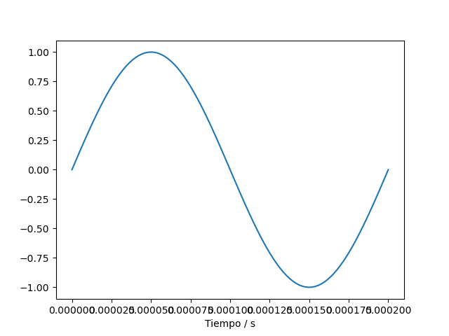

# Tarea-4

 Crear un esquema de modulación BPSK para los bits presentados. Esto implica asignar una forma de onda sinusoidal normalizada (amplitud unitaria)
 para cada bit y luego una concatenación de todas estas formas de onda.
 
 \begin{equation}
A = 3
\end{equation}
 
 h&theta;(x) = &theta;o x + &theta;1x 

