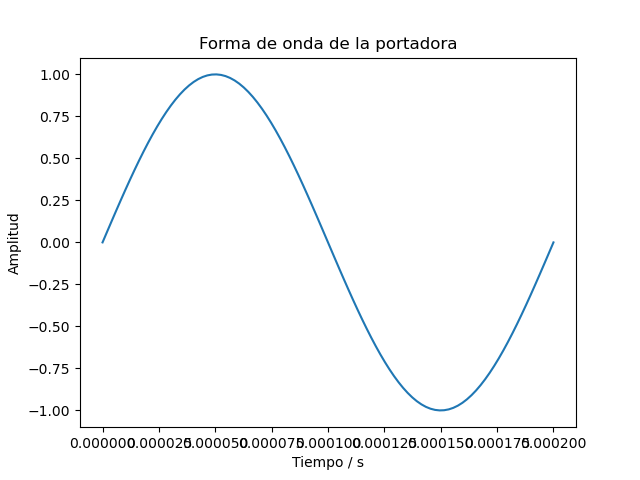

# Tarea-4

 ## 1) Crear un esquema de modulación BPSK para los bits presentados. Esto implica asignar una forma de onda sinusoidal normalizada (amplitud unitaria) para cada bit y luego una concatenación de todas estas formas de onda.
 
 Primeramente la modulación es una alteración sistemática de una onda portadora de acuerdo con el mensaje de la señal modulada y puede ser también una codificación
 por ejemplo las señales de banda producidas por diferentes fuentes de información que no son siempre adecuadas para la transmición directa através de un canal dado.
 Una modulación BPSK, es una forma de modulación cuadrada de la portadora suprimida de una señal de onda continua. Es decir, con la transmición por desplazamiento de fase 
 binaria (BPSK), son posibles dos fases de salida para una sola frecuencia de la portadora. Una fase de salida representada con 1 lógico y la otra a un 0 lógico. La modulación (BPSK) se utiliza para transmisores de bajo costo que no requieren altas velocidadedes.
En la figura de abajo se muestra la "Forma de onda senosoidal normalizada"

## 2)  Calcular la potencia promedio de la señal modulada generada.

Lo que primero que se hizo es encontrara la potencia instantanea de la señal modulada.Posteriormente se realizó la potencia promedio a partir de la potencia instantanea.

\begin(equation)
E
\end(equation)
