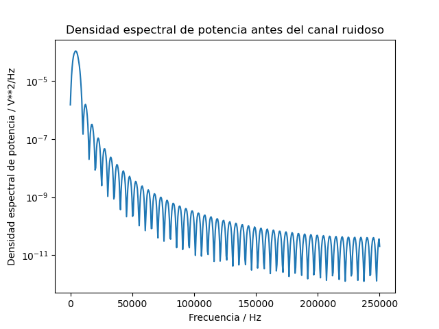

# Tarea-4

 ## 1) Crear un esquema de modulación BPSK para los bits presentados. Esto implica asignar una forma de onda sinusoidal normalizada (amplitud unitaria) para cada bit y luego una concatenación de todas estas formas de onda.
 
 Primeramente la modulación es una alteración sistemática de una onda portadora de acuerdo con el mensaje de la señal modulada y puede ser también una codificación
 por ejemplo las señales de banda producidas por diferentes fuentes de información que no son siempre adecuadas para la transmición directa através de un canal dado.
 Una modulación BPSK, es una forma de modulación cuadrada de la portadora suprimida de una señal de onda continua. Es decir, con la transmición por desplazamiento de fase 
 binaria (BPSK), son posibles dos fases de salida para una sola frecuencia de la portadora. Una fase de salida representada con 1 lógico y la otra a un 0 lógico. La modulación (BPSK) se utiliza para transmisores de bajo costo que no requieren altas velocidadedes.
En la figura de abajo se muestra la "Forma de onda senosoidal normalizada"

## 2)  Calcular la potencia promedio de la señal modulada generada.

Lo que primero que se hizo es encontrara la potencia instantanea de la señal modulada.Posteriormente se realizó la potencia promedio a partir de la potencia instantanea.
El resultado obtenido en pycharm es de 0.49500049500049487, este resultado se puede verificar en el código.

## 3)  Simular un canal ruidoso del tipo AWGN (ruido aditivo blanco gaussiano) con una relación señal a ruido (SNR) desde -2 hasta 3 dB.

Dado que en la realidad cuando se transmite una señal por un medio ya sea por el espacio como las ondas de radio o por un medio como un cable, la señal transmitida no tendrá una forma definida debido al ruido ocacionado por el medio por la que la señal es transmitida. A un canal ruidoso del tipo (AWGN) también conocido como ruido blanco gaussiano por lo que exite una relación de señal a ruido (SNR). En las figuras que aparecen en la parte inferior en donde se muestra señales con -2dB,3dB y -2dB hasta 3dB, en el códogo se puede ver los pasos que se realizaron para llegar a las gráficas que se puden ver.

## 4)  Graficar la densidad espectral de potencia de la señal con el método de Welch (SciPy), antes y después del canal ruidoso.

Atendiendo a su definición técnica, la densidad espectral de potencia (PSD) es la variación de energía que hay dentro de una señal vibratoria, en función de la frecuencia por unidad de masa. En otras palabras, la función de densidad espectral muestra para cada frecuencia si la energía presente es mayor o menor.
#### Espectral  
Indica que la densidad espectral de potencia PSD es una función respecto de la frecuencia. La densidad espectral de potencia representa así la distribución de una señal en función del espectro de frecuencias. 
#### Potencia 
Indica que la magnitud de la función de densidad espectral de potencia corresponde con el valor medio cuadrático de la señal que ha sido analizada. 

## 5) Demodular y decodificar la señal y hacer un conteo de la tasa de error de bits (BER, bit error rate) para cada nivel SNR.

Debido a que la señal transmitida posee mucho ruido, lo que causaría es que cuando se trate de decodificar la señal transmitida puede tener muchos errores ya que, la información transmitida en forma de bits al principio puede ser que cuando sea decodificada esta tenga errores, es decir que el conjunto de bits transmitidos al principio sea diferente a los bits recibidos. Por ende, lo que se pretende reducir al máximo posible los errores por causa del ruido producido según el medio por el cual la señal fue transmitida por ende, en este apartado se decodifico la señal mediante la implementación del if y se puso dos condiciones cuando es un 1 lógico o un 0 lógico y se comparo con la señal original de la señal portadora, con el propósito de reducir los errores de transmisión de bits a causa del ruido provocado por el medio por donde se transmitió la señal. 
Por lo que, para determinar si existe errores de transmisión lo que se procedió a hacer es una sumatoria de todos los posibles errores de la señal, dado esto para obtener dicho error se restó los bits transmitidos en la señal portadora menos los bits recibidos. En el código se puede ver en la sección que respecta para este apartado que el error obtenido para cada una de las señales transmitidas con ruido es cero.

## 6)  Graficar BER versus SNR.

